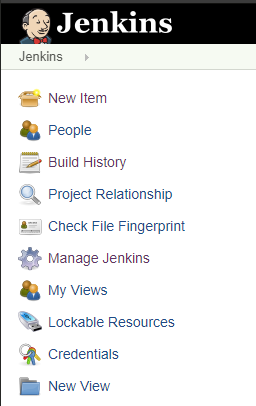
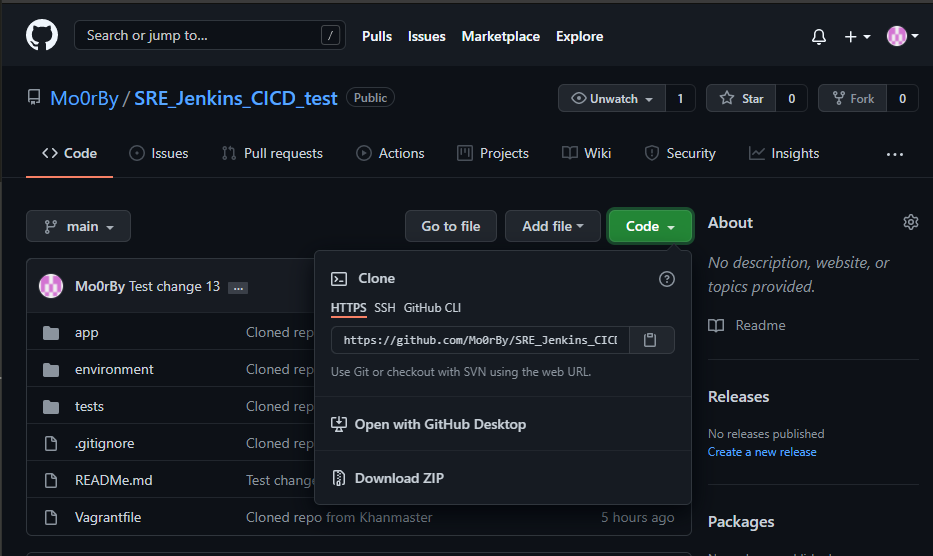
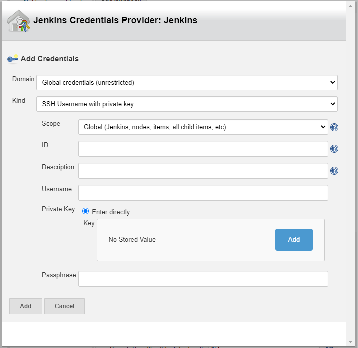

# SSH Setup between Localhost and Github
## Generating SSH Keys

1. Open a command line terminal and input the command > `ssh-keygen -t rsa -b 4096 -C "john.smith@email.com"` *(Use the same email address that is associated with your Gthub account)*
2. Input a logical key name, or leave it blank. Leaving this blank will generate a key with the default name `id_rsa`
3. **DO NOT GIVE THE KEY A PASSPHRASE**
4. Can use `ls` to see what has been generated. Should see 2 new items, `<keyname>` and `<keyname>.pub`

## Deploying .pub key to Github
1. Go to your Github settings
2. Go to `SSH and GPG keys`
3. Click `New SSH Key`
4. Give the key a logical title name
5. Navigate to your generated key pair from above and `cat` the `.pub` key. Copy **all** the text and paste it into the `key` section

## Creating a Webhook (to work with Jenkins)
1. Navigate to your GitHub repo's settings page, navigate to `Webhooks` and select `Add webhook`.
2. Under `Payload URL`, input the IP address used by your Jenkins server, followed by `/github-webhook/`. If this is not added, *the webhook will __not__ work*.
3. Under `Content type`, select `application/json`.
4. Leave the `Secret` box empty.
5. Select the events that you want to trigger the webhook.
6. Check the `Active` check-box. If this is not added, *the webhook will __not__ work*.
7. Select `Add webhook`

# Creating CI
The end goal for this task is to push some sort of change to our Github repo, and have Jenkins automatically test the new code.
If the pushed code passes the tests, we want Jenkins to automatically merge our changes into the 'main' branch.

## Creating a Jenkins job
1. Go to your Jenkins page and select `New Item` at the top of the main menu list

    

2. Enter a logical name for the job and select `Freestyle project`. Click `OK`.

---
1. Select the `Discard old builds` check-box and change the `Max # of builds to keep` to 3
2. Select the `GitHub project` check-box and input the relevant GitHub HTTPS link from the green `Code` button.

3. Select the `Restrict where this project can be run` check-box and in `	Label Expression`, input `sparta-ubuntu-node`.
4. Under `Source Code Management`, select the `Git` radio-button.
Under `Repositories`, input the SSH url (from the green `Code` button) in `Repository URL`.
5. Under credentials, add a new key of the kind `SSH Username with private key`.
    - Generate a new key (as described in *Generating SSH Keys*)
    - Navigate to the **private** key and copy it into the `Private Key: Enter directly` section

    

    - Give the key logical name and description
    - Go to your GitHub repo's settings page and navigate to `Deploy Keys`
    - Select `Add Deploy Key`. Give the key a logical name.
    - Navigate to the **public** key (`.pub`) and copy the key into the `Key` section on GitHub.
    - In this case, we need this SSH key to allow write access, so we must check the `Allow write access` check-box.

6. Under `Branches to build` specifiy the relevant branch (`Dev` branch in this case).
7. Under `Build triggers`, select `GitHub hook trigger for GITScm polling` check-box.
8. Under `Build environment`, select `Provide Node & npm bin/ folder to PATH`. In the `NodeJS Installation` box, select `Sparta-Node-JS`
9. Under `Build`, select `Execute shell`.
10. Input the shell commands that you want to execute in this build.
11. Save and apply!